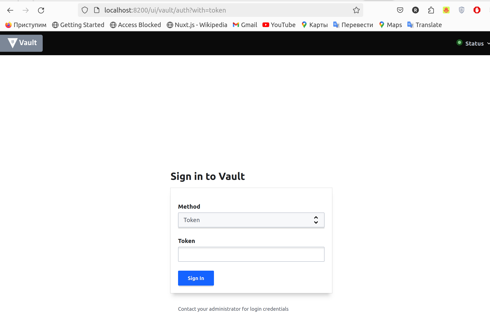

University: [ITMO University](https://itmo.ru/ru/)  
Faculty: [FICT](https://fict.itmo.ru)  
Course: [Introduction to distributed technologies](https://github.com/itmo-ict-faculty/introduction-to-distributed-technologies)
Year: 2023/2024  
Group: K4111c  
Author: Ivanov Alexander Anatolievich  
Lab: Lab1  
Date of create: 14.03.2024  
Date of finished:   

1. Была произведена установка minikube, после чего он был запущен с помощью команды "minikube start"

2. Был установлен контейнер vault

3. Был создан yaml манифест для создания Deployment, который является объектом Kubernetes, представляющим работающее приложение в кластере

4. После чего он был развернут в кластере 

5. Был создан сервис для доступа к этому контейнеру и к нем был проброшен 8200 порт, благодаря чему vault стал доступен по данному порту в браузере.

6. Чтобы получить токен для входа в vault были открыты и изучены логи пода, которые были найдены через графический интерфейс. Его можно запустить с помощью команды "minkube dashboard"

7. Был произведен вход в vault посредством полученного токена

Ответы на вопросы:

1. Было развернуто приложение для хранения секретов Vault в Kubernetes. Для этого был развернут один объект Deployment с двумя репликами пода, после чего для доступа к этому объекту был поднят специальный сервис, к которому был прокинут хостовой порт 8200 из-за чего он стал доступен с браузера.

2. Токен для входа в Vault хранится в логах пода

Схема

