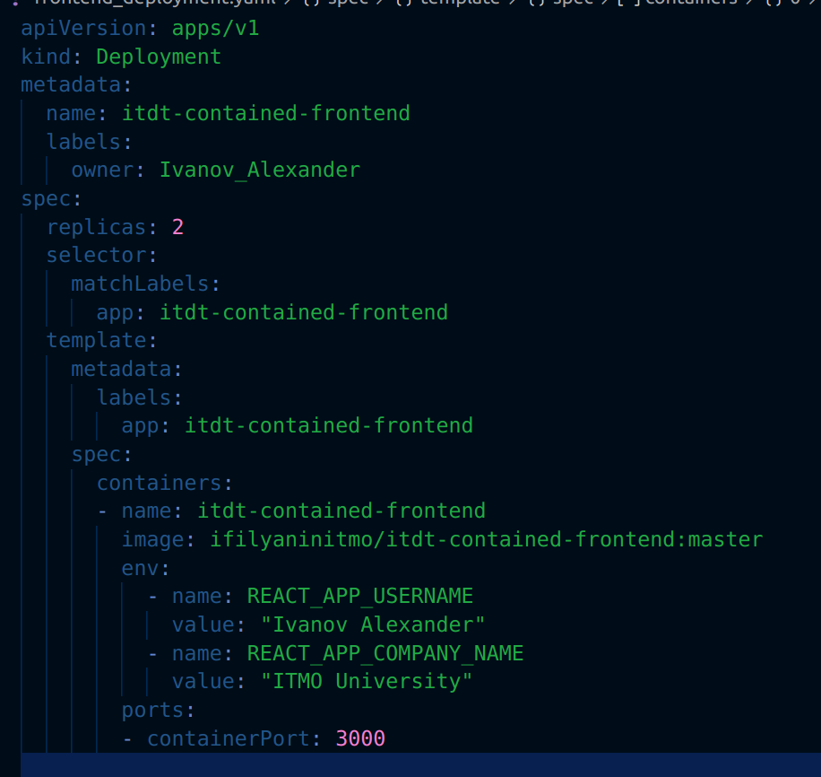
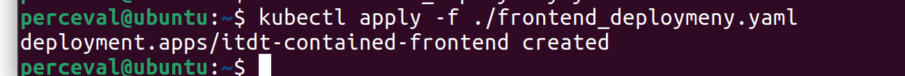
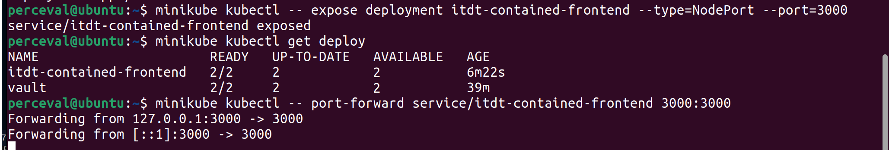
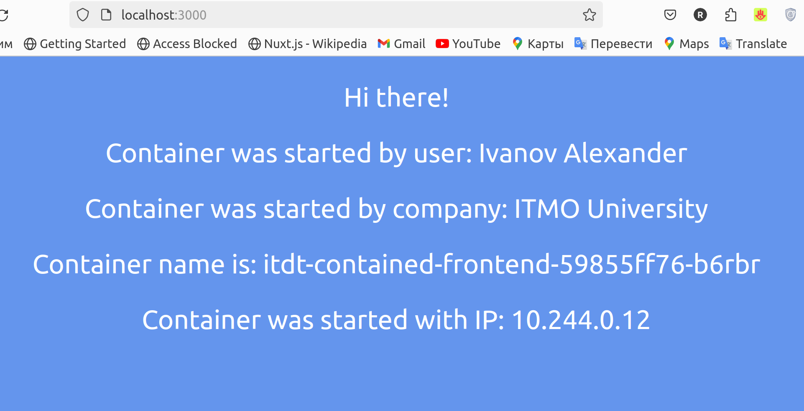
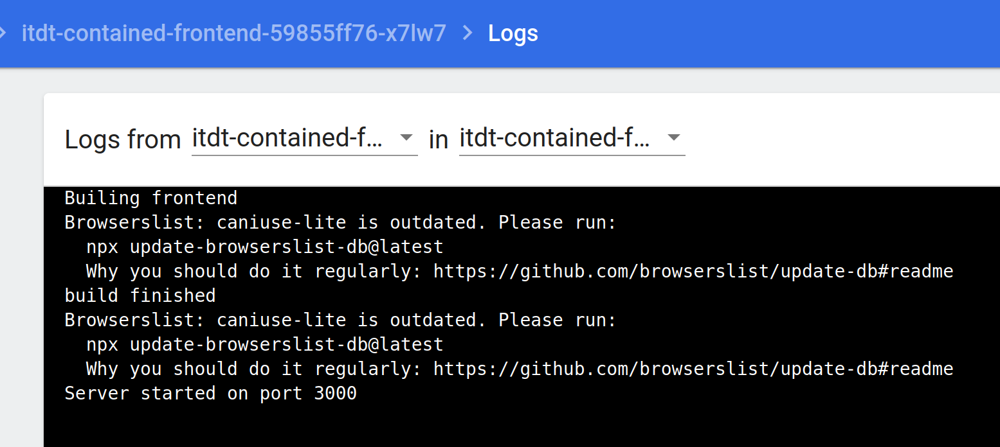
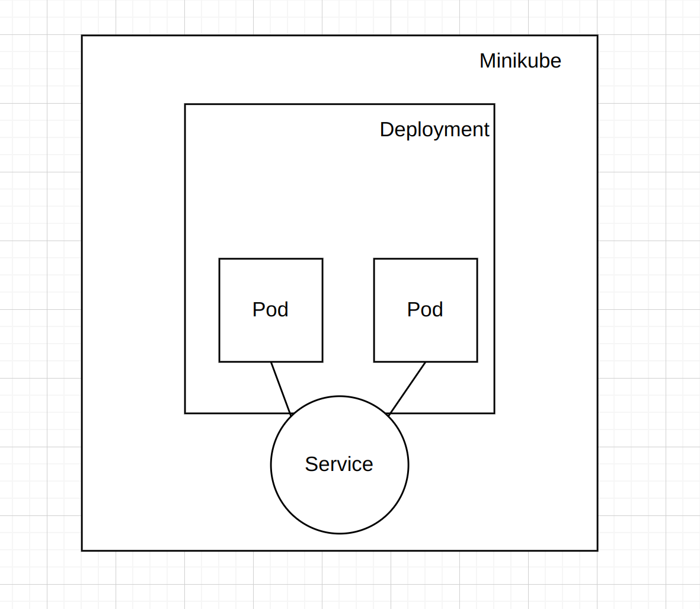

University: [ITMO University](https://itmo.ru/ru/)  
Faculty: [FICT](https://fict.itmo.ru)  
Course: [Introduction to distributed technologies](https://github.com/itmo-ict-faculty/introduction-to-distributed-technologies)
Year: 2023/2024  
Group: K4111c  
Author: Ivanov Alexander Anatolievich  
Lab: Lab2  
Date of create: 14.03.2024  
Date of finished:   

**1. Создание файл деплоймента и запуск.**  

 

**2. Создание сервиса для открытия доступа к внешнему трафику и прокидываем порт для доступа через браузера.** 

**3. Развёрнутое приложение в веб-браузере** 

Значения переменных соответствуют тем, которые были переданы в коде манифеста деплоймента. 
Также указано название пода и IP адрес - они могут меняться в завимости от того, в какой под идёт запрос. 
Запущены две реплики, в браузере отображается информация об одной из них. 

**4. Логи контейнеров** 

**5. Схема** 
